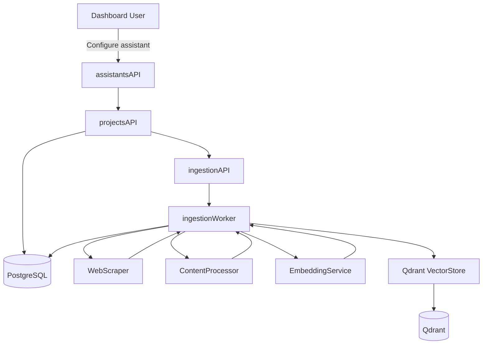
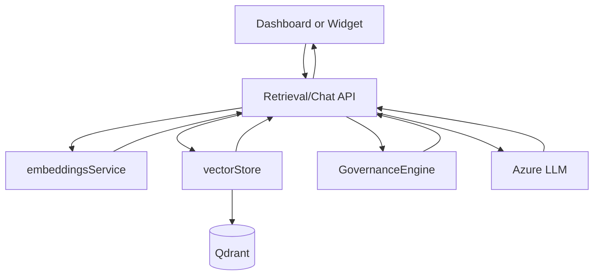

## Flakers Studio – Architecture

### Backend Architecture

The backend is a FastAPI application organized into clear domains to support a multi-tenant SaaS model and future provider extensibility.

#### Core Layers

- **Config (`backend/config`)**
  - `settings.py`: Pydantic settings (`ENVIRONMENT`, DB URL, Qdrant URL/API key, Azure OpenAI config, governance defaults).
  - `database.py`: Async SQLAlchemy engine/session setup, Base metadata, and `init_db`.
  - `logging.py` (planned): Structured, JSON logging with tenant and assistant context.

- **Domain Models (`backend/models`)**
  - **Tenants & Auth**
    - `tenant.py`: `Tenant` model with metadata and lifecycle state.
    - `user.py`: `User` model (email, password hash, status).
    - `membership.py`: `UserTenantMembership` linking users to tenants with roles and permissions.
  - **Projects & Assistants**
    - `project.py`: `Project` as a tenant-scoped container for assistants and ingestion jobs.
    - `assistant.py`: `Assistant` with template, site URL, governance rules, system prompt, and ingestion stats.
  - **Content & Ingestion**
    - `content.py`: `ContentChunk` and `IngestionJob` tracking ingestion pipeline and vector linkage.
    - `ingestion_tracking.py`: `IngestionURL` and `IngestionChunk` for per-URL and per-chunk state.
  - **Chat & Governance**
    - `chat.py`: `ChatSession`, `ChatMessage`, `ChatDecision`, `RefusalReason` for full auditability.
  - **API Keys & Public Access**
    - `api_keys.py` (planned): Per-tenant/assistant keys for widget/public API use.

- **Services & Domains**
  - **Auth & Tenants (`backend/services/auth.py`, `backend/tenants/`)**
    - Registration, login, password hashing.
    - JWT issuance and validation.
    - Tenant and membership creation, role enforcement.
  - **Assistants (`backend/assistants/`)**
    - Assistant creation including governance rule and allowed-intent derivation from templates.
    - Assistant activation, status sync, deletion and cleanup.
    - System prompt generation combining template and governance constraints.
  - **Ingestion (`backend/ingestion/`)**
    - `web_scraper.py`: Parallel website/WordPress scraping and progress callbacks.
    - `content_discovery.py`: Discovery job orchestration and URL recording.
    - `content_processor.py`: Cleaning, chunking, and content classification (intent, policy/sensitive flags).
    - `ingestion_service.py`: End-to-end pipeline from scraped content → chunks → embeddings → Qdrant → `ContentChunk`.
    - `status_updater.py`: Synchronizing assistant/job status, restart logic, and stale-job cleanup.
    - `project_deletion.py`: Safe deletion flows for projects and their data.
  - **Retrieval & RAG (`backend/retrieval/`)**
    - `rag_pipeline.py`: Query embedding, retrieval, governance evaluation, and prompt construction.
    - `retrieval_service.py`: High-level interface used by chat APIs and future batch workflows.
  - **Vector Providers (`backend/vector_providers/`)**
    - `base.py`: `VectorStore` abstraction (init, upsert, search, delete, ensure_collection).
    - `qdrant_provider.py`: Qdrant-backed implementation using the existing payload schema and filters.
  - **Governance (`backend/services/governance.py`)**
    - `GovernanceEngine` and `GovernanceDecision` types.
    - Implements core rules: require context, tenant isolation checks, intent filtering, confidence thresholds, policy quote-only behavior, and attribution constraints.
  - **LLM & Embeddings (`backend/services/azure_ai.py`, `backend/services/embeddings.py`)**
    - `AzureAIService` for chat completions.
    - `EmbeddingService` for query and content embeddings.
  - **Analytics & Observability**
    - `analytics.py` services layered over chat/content models.
    - Future `observability/` for metrics, traces, and dashboards.

#### API Layer (`backend/api`)

All endpoints are versioned under `/api/v1` except health/public endpoints:

- `auth.py`: Login/registration, token refresh, and user profile.
- `tenants.py`: Tenant CRUD, membership management, tenant selection.
- `assistants.py`: Assistant CRUD, governance preview, activation, and deletion.
- `projects.py`: Project CRUD, website/WordPress scrape orchestration, and ingestion triggering.
- `chat.py`: Governed chat/RAG endpoints (dashboard-facing).
- `public_chat.py`: Widget/public chat API using API keys and tightened rate limits.
- `analytics.py`: System and assistant analytics.
- `status.py`: Job status, assistant status, and system health.

The API layer is intentionally thin—routes validate input, enforce auth/tenant context, and delegate to domain services.

### Frontend Architecture

- **Dashboard (`frontend/dashboard`)**
  - Next.js with App Router and Tailwind CSS.
  - Screens:
    - Auth/login, tenant selection.
    - Dashboard overview with assistants and projects.
    - Assistant creation wizard (source selection, template choice, governance preview).
    - Content discovery and governance review screens.
    - Content ingestion progress monitors.
    - Governed chat UI integrated with Tambo components.
  - Shared utilities (`src/lib`) wrap backend APIs and normalize DTOs.
  - `auth-context.tsx` manages JWT and tenant selection locally.

- **Widget (`frontend/widget`)**
  - Framework-agnostic TypeScript bundle:
    - Global `FlakersStudioWidget.init({ tenantId, assistantId, apiKey, ... })`.
    - Renders a launcher and chat window into a host page container.
    - Calls public chat APIs with a scoped key and assistant/tenant IDs.
  - Built for CDN delivery with cache-friendly semantics and small footprint.

### Data and Control Flows

#### Ingestion & Indexing

- API schedules discovery and ingestion jobs into Postgres.
- Workers pull jobs, scrape content, process into chunks, embed, and upsert into Qdrant via `VectorStore`.
- Tracking tables (`IngestionJob`, `IngestionURL`, `IngestionChunk`) record fine-grained status and metrics.

#### Retrieval & RAG

- Retrieval API:
  - Resolves `current_tenant` and verifies assistant ownership.
  - Embeds query and calls `VectorStore.search` within appropriate assistant/tenant collection.
  - Passes retrieved chunks plus query and tenant info into `GovernanceEngine.evaluate_query`.
  - On `REFUSE`, returns structured refusal with reasons and rules.
  - On `ANSWER`, builds a constrained system prompt and calls Azure LLM.
  - Logs `ChatMessage` with full context, sources, and timings.

### Multi-Tenancy and Isolation

- **Database**: All tenant-owned entities carry `tenant_id` and queries are always scoped by tenant context derived from JWT and memberships.
- **Vector Store**: Collections are assistant- and tenant-specific; queries filter by `assistant_id` (and, later, tenant metadata), eliminating cross-tenant leakage.
- **Auth**: Backend never trusts `tenant_id` from request bodies—tenant context is derived from auth and membership mapping.
- **Widget**: Public APIs require per-tenant/assistant API keys and are CORS-restricted for widget usage.

