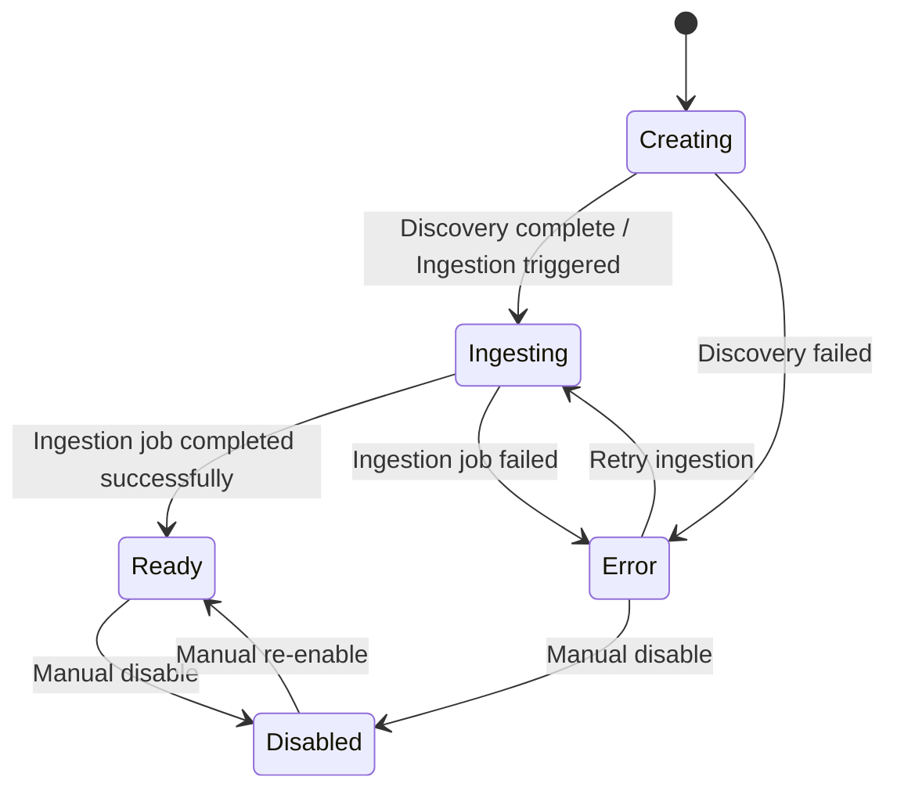

## Flakers Studio – Assistant Lifecycle

### States and Transitions

Each assistant passes through a series of well-defined lifecycle states. These states are stored in the `Assistant` model and driven by ingestion jobs and user actions.

### Lifecycle States

- **CREATING**
  - Assistant has been created but content discovery/ingestion is not complete.
  - Triggered immediately after assistant or project-website scrape creation.

- **INGESTING**
  - Content is being processed, embedded, and indexed into Qdrant.
  - Assistant should not yet be used for production chat.

- **READY**
  - Ingestion completed successfully and assistant is available for chat.
  - Governance rules and system prompt are set.

- **ERROR**
  - A failure occurred during discovery, scraping, processing, or ingestion.
  - Manual or automatic remediation is required before retrying ingestion.

- **DISABLED**
  - Assistant has been explicitly disabled and will not answer queries.

### Lifecycle Diagram

### Key Actors

- **Tenant User (Dashboard)**  
  Configures assistants, reviews content, and triggers ingestion.

- **Backend API**  
  Orchestrates assistant creation, discovery and ingestion jobs, and status transitions based on job outcomes.

- **Ingestion Workers**  
  Execute long-running discovery and ingestion tasks and update job and assistant status.

### Detailed Lifecycle Flow

#### 1. Creation

1. Tenant user configures a new assistant via dashboard:
   - Provides tenant context, project selection/creation, source type, site URL, and template.
2. Backend:
   - Ensures a `Project` exists for the tenant (creates one if needed).
   - Creates `Assistant` with:
     - Status `CREATING`.
     - Governance rules and allowed intents derived from template.
   - Creates an `IngestionJob` in `RUNNING` state with `current_stage = discovery`.
   - Schedules or starts content discovery (website/WordPress).

#### 2. Discovery

1. Discovery job uses `WebScraperService` to crawl and scrape pages.
2. Each discovered page yields an `IngestionURL` record with status:
   - `SCRAPED` if content captured successfully.
   - `FAILED_SCRAPING` if errors occurred.
3. `IngestionJob`:
   - Tracks URL counts and errors.
   - Moves to `current_stage = discovery_complete` when discovery finishes.
4. Assistant:
   - `total_pages_crawled` is updated from discovered/scraped URLs.
   - Remains in `CREATING` until ingestion begins.

#### 3. Governance Review (Optional UX Layer)

- Dashboard may present a governance review screen:
  - Lists discovered URLs and their raw content or summaries.
  - Allows admins to confirm which content types/intents are in scope.
  - Shows generated governance rules and template-specific behavior.
- Backend stores any updated governance configuration on the assistant.

#### 4. Ingestion

1. Tenant user or system triggers ingestion for the assistant.
2. Ingestion worker:
   - Loads scraped URLs from `IngestionURL`.
   - Processes each into chunks via `ContentProcessor`.
   - Generates embeddings via `EmbeddingService`.
   - Stores vectors into Qdrant via `VectorStore` / `QdrantVectorStore`.
   - Persists `ContentChunk` rows with Qdrant point IDs.
3. `IngestionJob`:
   - Moves through stages: `processing` → `embedding` → `ingestion` → `storing`.
   - On completion, sets `status = COMPLETED` and `current_stage = completed`.

4. Assistant:
   - Moves from `CREATING` or `INGESTING` → `READY`.
   - `total_chunks_indexed` and `total_pages_crawled` updated.
   - `last_ingestion_at` set to completion time.

#### 5. Ready for Chat

In the READY state:

- Assistant can be used by:
  - Dashboard chat interface (internal).
  - Public widget (external) if enabled and properly configured.
- Governance is fully enforced by:
  - `GovernanceEngine` evaluating each query and retrieval result.
  - RAG pipeline obeying governance constraints when calling LLMs.
- Analytics and observability:
  - Chat sessions and messages are tracked.
  - Answer/refusal rates and performance metrics are available.

#### 6. Error Handling

If discovery or ingestion fails:

- `IngestionJob.status` is set to `FAILED` with `error_details`.
- Assistant status may transition to `ERROR` with an explanatory `status_message`.
- Operators can:
  - Inspect errors via status and analytics APIs.
  - Adjust configuration (e.g., excluded patterns, crawl depth).
  - Trigger a retry ingestion job.

#### 7. Disabling and Deletion

- **Disable Assistant**
  - Admin can disable an assistant (status → `DISABLED`).
  - Chat APIs refuse usage for disabled assistants.

- **Deletion**
  - Project or assistant deletion flows:
    - Mark resources for deletion.
    - Cancel or complete ongoing ingestion jobs.
    - Remove Qdrant collections/points for the assistant.
    - Cascade-delete assistant data (content, jobs, chat history) in Postgres.

### Lifecycle and Multi-Tenancy

- All lifecycle operations are tenant-scoped:
  - `Assistant`, `Project`, and `IngestionJob` records always carry `tenant_id`.
  - Only users with appropriate membership/role in a tenant can operate on its assistants.
  - Widget APIs validate that assistants and API keys belong to the same tenant.

