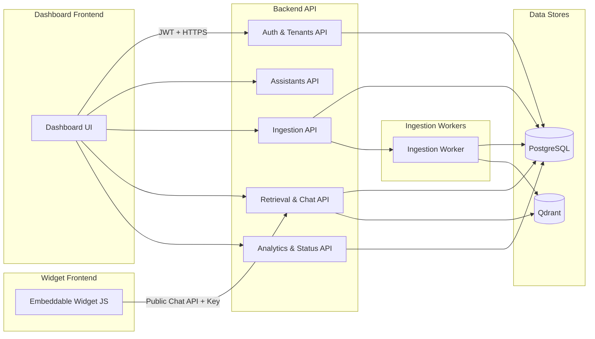

## Flakers Studio – System Overview

### Purpose

Flakers Studio is a multi-tenant SaaS platform for creating governed AI assistants that answer strictly from tenant-owned content (websites, WordPress) using a retrieval-augmented generation (RAG) pipeline backed by Qdrant.

### High-Level Components

- **Frontend – Dashboard (`frontend/dashboard`)**  
  Next.js application used by tenant admins and users to:
  - Authenticate and select a tenant context.
  - Create and manage assistants and projects.
  - Trigger website/WordPress ingestion flows.
  - Review discovered content and governance configuration.
  - Run governed chat sessions against assistants.

- **Frontend – Embeddable Widget (`frontend/widget`)**  
  Lightweight JS bundle that tenants embed on their sites:
  - Renders a chat launcher and assistant UI.
  - Calls public chat/retrieval APIs with tenant/assistant credentials.
  - Is served from a CDN for low-latency, globally distributed delivery.

- **Backend API (`backend`)**  
  FastAPI service responsible for all core logic:
  - **Auth & Tenants**: First-party auth, user accounts, tenant entities, and membership/role models.
  - **Assistants**: Assistant lifecycle management, templates, governance configuration, and statistics.
  - **Ingestion**: Website/WordPress discovery, scraping, chunking, and ingestion job management.
  - **Retrieval & RAG**: Query embedding, semantic retrieval from Qdrant, governance evaluation, and LLM orchestration.
  - **Analytics & Status**: System- and assistant-level analytics, ingestion job monitoring, and system health.

- **Ingestion Workers (`backend/workers`)**  
  Long-running processes that:
  - Execute ingestion jobs (scraping, processing, embedding, indexing).
  - Are decoupled from the API process and can be scaled independently.
  - Consume jobs from a queue abstraction (DB-backed initially, pluggable for Redis/Celery later).

- **Vector Store – Qdrant (`backend/vector_providers`)**  
  Qdrant is the only supported vector provider for MVP:
  - Stores semantic embeddings of content chunks.
  - Uses assistant/tenant-scoped collections and payload filters to guarantee isolation.
  - Is accessed via a `VectorStore` abstraction so other providers (Pinecone, Weaviate) can be added later.

- **Relational Database (PostgreSQL)**  
  System-of-record for:
  - Tenants, users, and memberships.
  - Projects, assistants, governance config.
  - Ingestion jobs, URLs, chunks, tracking state.
  - Chat sessions, messages, and governance decisions.

- **LLM & Embeddings (Azure OpenAI)**  
  - Embeddings for queries and content chunks.
  - LLM completions for governed RAG responses and other assistant workflows.

### Multi-Tenant Model

- **Tenants** represent customer organizations.
- **Users** belong to one or more tenants via memberships with roles (owner, admin, member).
- **Projects** are tenant-scoped containers grouping assistants and ingested content.
- **Assistants** live inside projects and inherit their tenant.
- All read/write paths enforce tenant isolation by:
  - Scoping DB queries by `tenant_id`.
  - Using assistant-specific Qdrant collections and payload filters.
  - Validating that the authenticated tenant owns the referenced assistant/project.

### Major Flows

- **Assistant Creation (Dashboard)**  
  1. User authenticates and selects a tenant.  
  2. User configures assistant (name, template, site URL, source type).  
  3. Backend creates `Project` (if needed) and `Assistant`, generates governance rules, and schedules a discovery job.  
  4. Ingestion worker crawls the site, stores `IngestionURL` records, and updates `IngestionJob` state.  
  5. User reviews discovered content and confirms ingestion.

- **Ingestion & Indexing**  
  1. Worker processes scraped content → chunks (cleaning, chunking, classification).  
  2. Embeddings are generated for chunks and stored in Qdrant via `VectorStore`.  
  3. `ContentChunk` rows are persisted with Qdrant point IDs and governance flags.  
  4. Assistant moves to `READY` when ingestion completes successfully.

- **Governed Chat (Dashboard & Widget)**  
  1. Client sends query with assistant/tenant context to retrieval API.  
  2. Backend embeds the query, retrieves candidate chunks from Qdrant, and passes them through the governance engine.  
  3. Governance engine either refuses (with reason and rules) or approves and builds a bounded system prompt.  
  4. LLM generates a response strictly constrained to the approved context.  
  5. Backend returns structured data: decision, answer/refusal, sources, rules, timings.  
  6. Frontend renders Answer/Refusal cards and governance panels using Tambo components.

### High-Level Diagram

